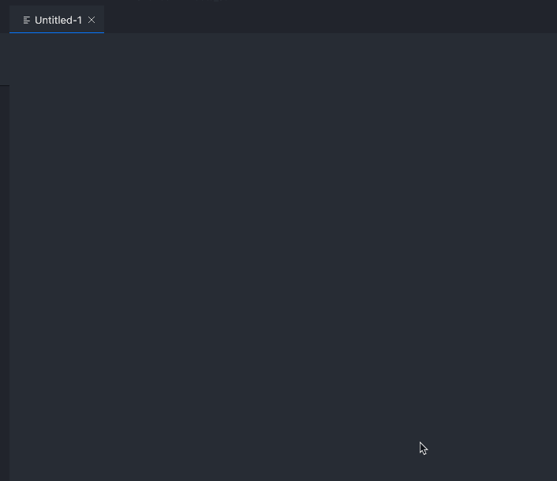

# vscode-dbt README

Provides snippets for dbt-flavoured SQL in VSCode

## Features

### Generic Jinja
for loops, conditionals, blocks, variable settings etc. See [source](./snippets/snippets.json) for a full list


### dbt-flavoured SQL
ref, source, log, config etc. See [source](./snippets/snippets.json) for a full list.



## Requirements

- Syntax highlighting, and jinja comments `{# comment #}` formatting is extremely well implemented in the [Better Jinja VSCode extemsion](https://marketplace.visualstudio.com/items?itemName=samuelcolvin.jinjahtml). **You really should install it as this extension is meant to work for the language `jinja-sql` which is implemented in this extention**
- Once you have installed the Better Jinja extension you may want to associate your `.sql` files with the `jinja-sql` language that you do not have to select it every time **but this is entirely up to you and your use case**. For example, you may in some cases not want to write dbt-/jinja-flavoured SQL.
- To associate your `.sql` files with `jinja-sql` (optional but recommended) language add the following to your `settings.json` file:
```json
   "files.associations":{
      "*.sql":"jinja-sql",
   }
```

## Credits
### dbt jinja concepts
adapted from https://github.com/fishtown-analytics/atom-dbt/blob/master/snippets/dbt-sql.cson

### Jinja Concepts
adapted from  https://github.com/danielchatfield/atom-jinja2/blob/master/snippets/atom-jinja2.cson
and https://github.com/fishtown-analytics/atom-dbt/blob/master/snippets/dbt-jinja.cson

## Release Notes
